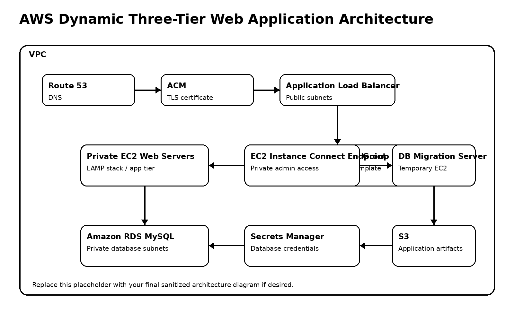

# Hosting a Dynamic Three-Tier Web Application on AWS

## Executive Summary

This project documents a lab deployment of a dynamic, database-driven web application on AWS using a three-tier architecture. The deployment uses a public load-balancing layer, private application servers, a private MySQL database tier, centralized secret storage, TLS, DNS routing, database migration, reusable server images, and Auto Scaling.

The goal of this project was to move beyond static website hosting and practice a production-style architecture pattern: public entry point, private compute tier, private database tier, controlled traffic flow, credential handling, health checks, scaling behavior, and cost-aware cleanup.

> Public portfolio note: This repository documents the architecture, security model, deployment workflow, validation evidence, troubleshooting, and lessons learned. It does not include real AWS account identifiers, secrets, database credentials, or course-owned application source code.

---

## Architecture Diagram



---

## Real-World Use Cases

This architecture pattern is useful for learning and demonstrating:

- Database-driven web application hosting
- Secure multi-tier AWS application architecture
- Private application and database subnet design
- Load-balanced application delivery
- TLS-enabled application access
- RDS-backed application deployment
- Auto Scaling and health-check-based replacement
- Cloud security documentation and evidence capture

---

## Architecture Overview

The application follows a three-tier AWS architecture.

### 1. Network Edge

Route 53 routes user traffic to an Application Load Balancer. ACM provides the TLS certificate used by the ALB for HTTPS traffic. The ALB is deployed in public subnets and acts as the only internet-facing application entry point.

### 2. Application Tier

The application tier runs on EC2 web servers in private application subnets. The servers run a LAMP stack and retrieve application artifacts from S3. The web server security group only accepts HTTP/HTTPS traffic from the ALB security group and SSH traffic from the EC2 Instance Connect Endpoint security group.

### 3. Data Tier

The data tier uses Amazon RDS MySQL in private database subnets. The RDS security group only allows MySQL traffic from the web server security group and the temporary database migration server security group. AWS Secrets Manager stores the database credentials.

---

## Traffic Flow

1. A user accesses the application using a custom domain managed in Route 53.
2. Route 53 routes the request to the Application Load Balancer.
3. The ALB receives HTTP/HTTPS traffic from the internet.
4. The ALB forwards valid requests to EC2 web servers in private application subnets.
5. The web servers process the dynamic application request using Apache, PHP, and the application code.
6. The application connects to Amazon RDS MySQL using database credentials stored in AWS Secrets Manager.
7. The database returns data to the application server.
8. The web server responds through the ALB back to the user.

---

## AWS Services Used

- Amazon VPC
- Public and private subnets
- Route tables
- Internet Gateway
- NAT Gateway
- Elastic IP
- Security Groups
- EC2
- EC2 Instance Connect Endpoint
- IAM roles and custom IAM policies
- S3
- AWS Secrets Manager
- Amazon RDS MySQL
- Application Load Balancer
- Target Groups
- ACM
- Route 53
- AMI
- Launch Template
- Auto Scaling Group
- CloudWatch health and monitoring surfaces

---

## Skills Demonstrated

- Three-tier AWS architecture design
- Public/private subnet segmentation
- Private EC2 application deployment
- Private RDS database deployment
- Layered security group design
- IAM role and policy configuration
- Secrets Manager credential handling
- S3-based application artifact delivery
- SQL database migration using a temporary EC2 migration server
- ALB listener and target group configuration
- TLS certificate integration with ACM
- DNS routing with Route 53
- AMI creation from a configured application server
- Launch Template and Auto Scaling Group setup
- Health-check-based instance replacement
- Cost-aware teardown and cleanup

---

## Repository Structure

```text
aws-dynamic-webapp-three-tier-architecture/
│
├── README.md
├── diagrams/
│   └── architecture.png
│
├── docs/
│   ├── deployment-guide.md
│   ├── security-groups.md
│   ├── iam-and-secrets-manager.md
│   ├── database-migration.md
│   ├── troubleshooting.md
│   └── cleanup.md
│
├── evidence/
│   ├── sanitized-screenshots/
│   │   ├── vpc-subnets.png
│   │   ├── security-groups.png
│   │   ├── ec2-instance-connect-endpoint.png
│   │   ├── rds-private-subnet.png
│   │   ├── secrets-manager-redacted.png
│   │   ├── alb-target-health.png
│   │   ├── route53-record-redacted.png
│   │   └── autoscaling-replacement-test.png
│   │
│   └── validation-notes.md
│
├── scripts/
│   ├── db-migration-template.sh
│   └── app-deploy-template.sh
│
└── .gitignore
```

---

## Documentation Index

- [Deployment Guide](docs/deployment-guide.md)
- [Security Group Design](docs/security-groups.md)
- [IAM and Secrets Manager](docs/iam-and-secrets-manager.md)
- [Database Migration](docs/database-migration.md)
- [Troubleshooting](docs/troubleshooting.md)
- [Cleanup and Cost Controls](docs/cleanup.md)
- [Validation Notes](evidence/validation-notes.md)

---

## Security Model

This lab uses a layered traffic-control model:

- The ALB is the public entry point.
- EC2 web servers are private and do not receive direct internet traffic.
- SSH access is routed through EC2 Instance Connect Endpoint.
- RDS is private and only accepts MySQL traffic from approved security groups.
- Database credentials are stored in Secrets Manager.
- EC2 accesses S3 and Secrets Manager through an IAM role instead of hardcoded credentials.

---

## Validation Evidence

Recommended sanitized evidence to include:

| Evidence Item | Purpose |
|---|---|
| VPC/subnet screenshot | Shows network segmentation |
| Route table screenshot | Shows NAT Gateway route for private egress |
| Security group screenshot | Shows layered traffic restrictions |
| EC2 Instance Connect Endpoint screenshot | Shows private administrative access path |
| RDS screenshot | Shows private database deployment |
| Secrets Manager screenshot | Shows credential storage without exposing values |
| S3 artifact screenshot | Shows deployment artifact storage |
| ALB target health screenshot | Shows load balancer health validation |
| Route 53 screenshot | Shows DNS routing |
| ACM screenshot | Shows TLS certificate validation |
| Auto Scaling Group screenshot | Shows desired/min/max capacity |
| Instance replacement screenshot | Shows ASG resiliency behavior |

Sanitize all screenshots before publishing.

Remove or redact:

- AWS account ID
- Secret values
- Database password
- IAM access keys
- Sensitive public IPs
- RDS endpoint if you do not want it exposed
- Real domain values if you prefer privacy
- Course-owned application code or proprietary assets

---

## Production Improvements

If this lab were extended into a production-ready implementation, recommended improvements would include:

- Infrastructure as Code using Terraform.
- CI/CD pipeline for application deployment.
- VPC endpoints for S3 and Secrets Manager to reduce NAT Gateway dependency.
- Multi-AZ RDS deployment.
- RDS automated backups and restore testing.
- AWS WAF in front of the ALB.
- ALB access logs stored in S3.
- Centralized application and system logging with CloudWatch Logs.
- CloudTrail review for administrative activity.
- Secrets rotation for database credentials.
- Least-privilege IAM scoped to specific S3 bucket and Secrets Manager secret ARNs.
- Monitoring alarms for unhealthy targets, high latency, 5xx errors, and scaling events.
- Systems Manager Session Manager as an alternative private access pattern.

---

## Key Takeaways

- Dynamic applications require additional architecture considerations beyond static hosting.
- Private application and database tiers reduce direct internet exposure.
- Security group references help enforce tier-to-tier traffic boundaries.
- Secrets Manager improves credential handling compared with hardcoded credentials.
- EC2 Instance Connect Endpoint provides a private administrative access path.
- AMIs and Launch Templates make configured servers reusable.
- Auto Scaling Groups can restore desired capacity when an instance fails or is terminated.
- Cleanup discipline is part of responsible cloud engineering.
